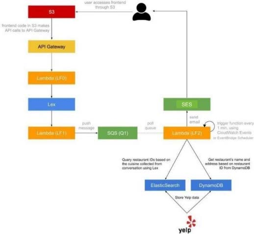

# Dining Concierge Chatbot

This project implements a **Dining Concierge Chatbot** that provides restaurant suggestions based on user preferences. The solution leverages AWS services like **Lex**, **Lambda**, **DynamoDB**, **Elasticsearch**, **SQS**, and **SES** in a serverless, microservice-driven architecture.

---

## Key Features

1. **Conversational Chatbot**:
   - Built using **Amazon Lex** with three intents:
     - `GreetingIntent`: Greets the user.
     - `ThankYouIntent`: Handles user gratitude.
     - `DiningSuggestionsIntent`: Collects dining preferences (location, cuisine, time, party size, and email).

2. **Restaurant Suggestions**:
   - User preferences are pushed to an **SQS queue**.
   - A backend worker Lambda retrieves these requests, fetches random restaurant recommendations, and emails the suggestions using **SES**.

3. **API Layer**:
   - Built using **API Gateway** and **AWS Lambda**.
   - Endpoints:
     - `POST /chat`: Forwards user messages to the Lex chatbot.
   - CORS enabled for frontend integration.

4. **Restaurant Data Management**:
   - **Yelp API**: Scrapes and collects over 5,000 restaurant records based on different cuisines.
   - **DynamoDB**: Stores complete restaurant data including:
     - Business ID, Name, Address, Coordinates, Reviews, Rating, Zip Code.
   - **Elasticsearch**: Stores restaurant `ID` and `Cuisine` for fast lookups.

5. **Suggestions Module**:
   - Decoupled backend worker Lambda:
     - Polls the **SQS queue** for requests.
     - Fetches restaurant recommendations from **Elasticsearch** and additional details from **DynamoDB**.
     - Sends formatted suggestions via **SES** to the user’s email.

6. **Frontend Application**:
   - Simple interface for interacting with the chatbot.
   - Hosted on **S3** with static website hosting.

7. **Deployment Automation**:
   - **AWS CodePipeline** automates CI/CD for Lambda functions and the frontend application.

---

## Architecture Diagram

---

## Workflow

1. **User Interaction**:
   - User chats with the Lex chatbot to provide preferences.
   - Preferences include: Location, Cuisine, Dining Time, Party Size, and Email.

2. **Data Flow**:
   - User inputs → Lex chatbot → Lambda function → SQS queue.
   - Backend Lambda pulls the request, fetches data from **Elasticsearch** and **DynamoDB**, and sends an email with restaurant suggestions.

3. **Restaurant Data**:
   - Restaurants are fetched using the **Yelp API**.
   - Complete records are stored in **DynamoDB**, while a subset (ID, Cuisine) is stored in **Elasticsearch**.

4. **Email Delivery**:
   - Suggestions are emailed to the user via **AWS SES**.

---

## Technologies Used

- **AWS Services**:
  - Lex, Lambda, DynamoDB, Elasticsearch, SQS, SES, API Gateway, CodePipeline, S3.
- **Data Source**: Yelp API for restaurant data.
- **Frontend**: Static website hosted on S3.

---

## Example Interaction
- User: I need some restaurant suggestions. 
- Bot: What city are you looking to dine in? 
- User: Manhattan 
- Bot: Got it. What cuisine would you like to try? 
- User: Japanese 
- Bot: How many people are in your party? User: Two 
- Bot: What time? 
- User: 7 pm 
- Bot: Great! Expect my suggestions shortly.

**Email Response**:
Hello! Here are my Japanese restaurant suggestions for 2 people at 7 pm:

1. Sushi Nakazawa, located at 23 Commerce St
2. Jin Ramen, located at 3183 Broadway
3. Nikko, located at 1280 Amsterdam Ave.
Enjoy your meal!

---

## How to Run

1. Deploy the frontend application to an **S3 bucket** for static website hosting.
2. Import the Swagger file into **API Gateway** to set up the API.
3. Deploy all Lambda functions and resources via **AWS CodePipeline**.
4. Scrape restaurant data using the **Yelp API** and store it in **DynamoDB** and **Elasticsearch**.
5. Test the Lex chatbot and its integrations with the API.

---

## Future Enhancements

- Add filtering for restaurant recommendations by neighborhoods.
- Implement user session state to remember past preferences.
- Enhance frontend with interactive search and results display.

